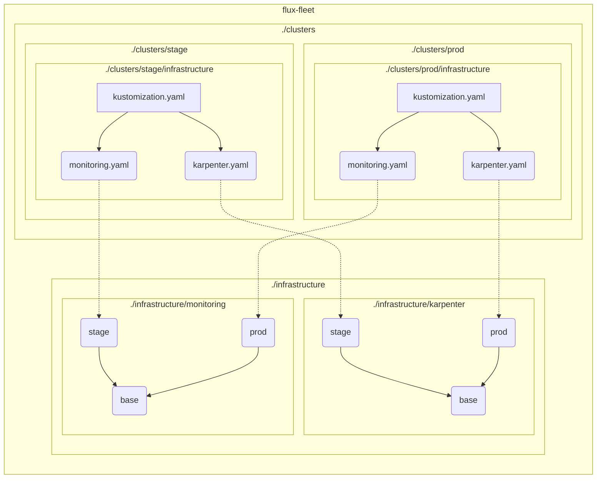

# flux-fleet

Example of flux management repo

Notes:

* vendor-locked to EKS
* everythong with `PLACEHOLDER` should be set to correct values: secrets, arns, etc
* secrets should be encrypted
* renovate updates stage cluster's HelmReleases, prod is updated manually at later point

## Design

